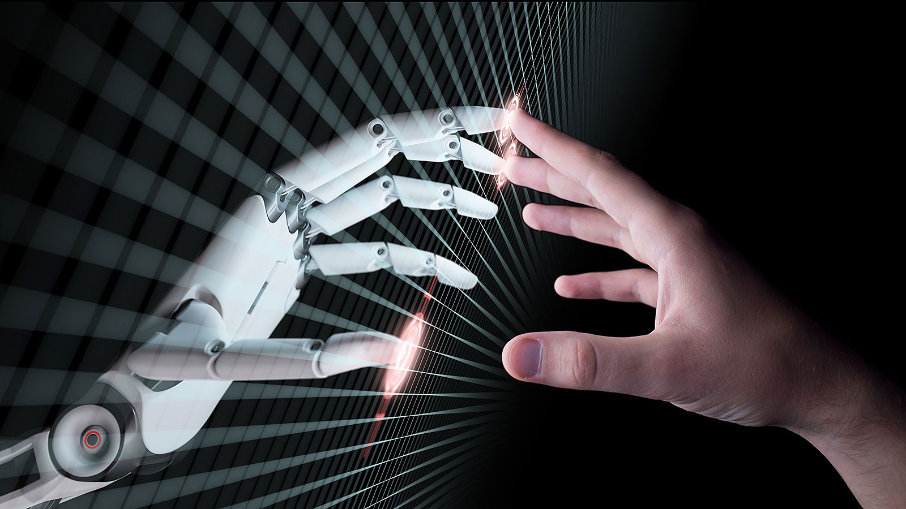

# My-Projects

I have implemented Machine Learning algorithms such as 
1. Single-layer Perceptron, 
2. Multi-layer Perceptron for Multi-way classification (Iris-dataset)
3. Logistic Regression
4. Naive Bayes classifier
5. K-Nearest Neighbour classifier
6. ROC-curve,AUC
7. Decision Tree classifier using (Play_Tennis dataset and Transport dataset)

Also implemented Mathematical Modelling concepts such as 
1. Seasonal-index
2. Spline-Interpolation'

Object Classification using Convolutional Neural Network (ml_package.ipynb)
